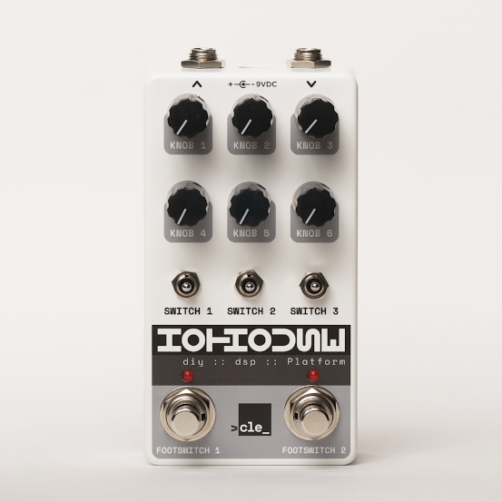
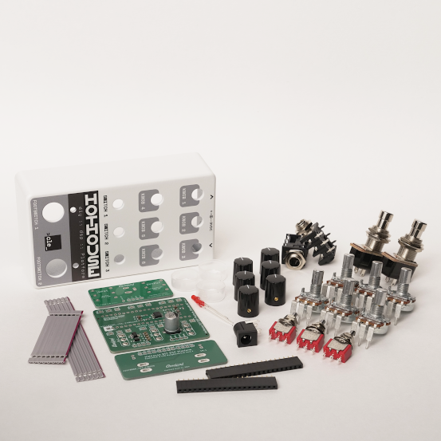
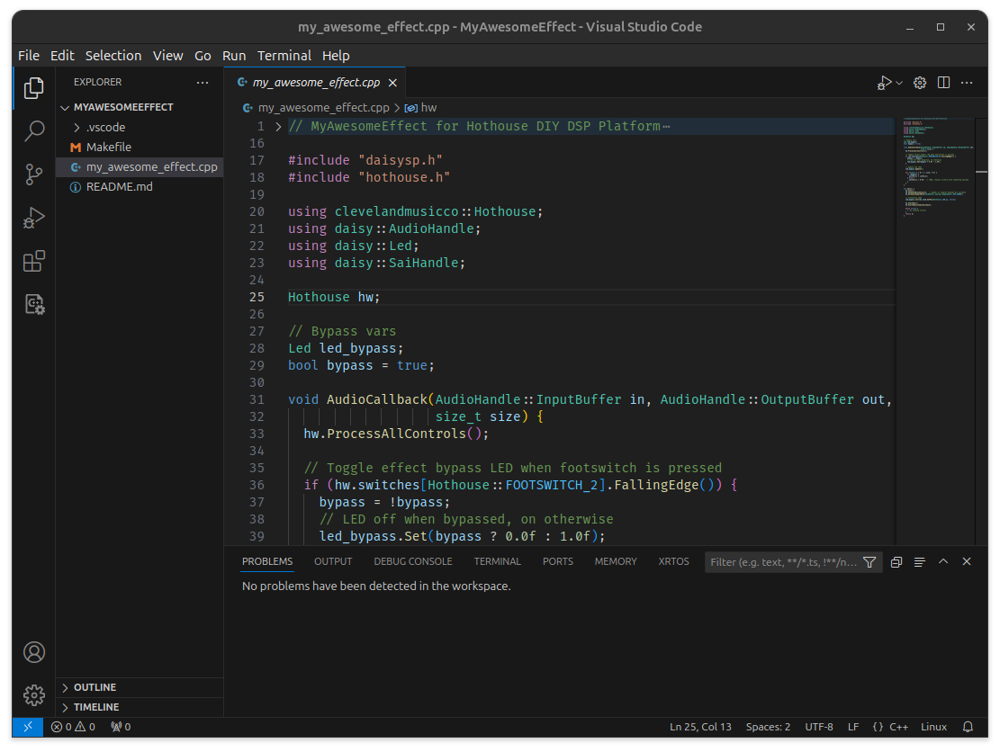

# Examples for Hothouse Digital Signal Processing Pedal Kit

**:wrench: Hothouse Build Guide [STEREO VERSION](https://github.com/clevelandmusicco/HothouseExamples/wiki/Cleveland-Music-Co.-Hothouse-DIY-Digital-Signal-Processing-Pedal-Kit-Build-Guide-(Stereo-Version)) and [MONO VERSION](https://github.com/clevelandmusicco/HothouseExamples/wiki/Cleveland-Music-Co.-Hothouse-DIY-Digital-Signal-Processing-Pedal-Kit-Build-Guide-(Mono-Version)) | :question: [FAQ](https://github.com/clevelandmusicco/HothouseExamples/wiki/Frequently-Asked-Questions) | :books: [Wiki](https://github.com/clevelandmusicco/HothouseExamples/wiki) | :globe_with_meridians: [Official Website](https://clevelandmusicco.com/)**

The [Cleveland Music Co. Hothouse](https://clevelandmusicco.com/hothouse-diy-digital-signal-processing-platform-kit/) is a compact pedal kit for the [Electrosmith Daisy Seed DSP](https://electro-smith.com/products/daisy-seed). You can use the Hothouse to easily get your Daisy Seed DSP projects off the breadboard and onto your pedalboard, and / or you can simply compile and flash any of the code in this repo to your Hothouse.



This project is a collection of digital signal processing code examples that you can use to get started with the Hothouse. In the `src` directory are ready-to-compile effects you can flash to your Hothouse or modify as you wish. Also included is a `create_new_proj.py` helper script that creates a compilable, VS Code-ready "scaffolding" project for writing your own effects for the Hothouse.

> [!IMPORTANT]
> Everything from this point on assumes:
> * You have some knowledge of the [Electrosmith Daisy Seed](https://electro-smith.com/products/daisy-seed?variant=45234245108004)
> * You understand [installing the Daisy Development Toolchain](https://github.com/electro-smith/DaisyWiki/wiki/1.-Setting-Up-Your-Development-Environment) is not something we cover here, but having it installed is a pre-requisite if you want to write your own effects code

If you're not familar with the Daisy Seed or its development environment, check out the [Electrosmith Daisy Ecosystem Wiki](https://github.com/electro-smith/DaisyWiki/wiki) to get yourself bootstrapped! Also be sure to bookmark the [Daisy Forum](https://forum.electro-smith.com/) and join the [Discord server](https://discord.gg/SuCtUsbD) to hang out with like-minded people committed to collective learning.

| 💥 Also Good To Know 💥 |
|-|
| For the sake of simplicity, the examples in this repository are written with a focus on the use of [DaisySP classes](https://electro-smith.github.io/DaisySP/annotated.html) whenever available. There are lots of third-party libre and [open-source DSP libraries](https://search.brave.com/search?q=open+source+%28inpage%3Adsp+OR+inpage%3A%22digital+signal+processing%22%29+libraries&source=web) out there that provide more advanced processing, but using them can be complicated and daunting for the uninitiated. These examples are about demonstrating the use of the Hothouse itself with as little distraction as is reasonable. That's not to say there won't be more advanced projects added at a later date, though ... |

## Getting started

### Prerequisites

* **[A Daisy Seed with 65MB of memory](https://electro-smith.com/products/daisy-seed?variant=45234245108004)** - While the 65MB is not critical, it is highly recommended. Several of the examples in this repo will not compile on the 1MB version of the Daisy Seed. Just spend the extra few dollars for the additional capacity.
* **[A Daisy development environment](https://github.com/electro-smith/DaisyWiki/wiki/1.-Setting-Up-Your-Development-Environment)** - Nothing that comes after this will work until you have the Daisy toolchain installed, configured, and functioning properly. **IF YOU CAN'T COMPILE CODE FROM [DAISYEXAMPLES](https://github.com/electro-smith/DaisyExamples), YOU WON'T BE ABLE TO COMPILE THE HOTHOUSE EXAMPLES.** So, be sure to get things working as per the Electrosmith documentation.
* **[A Cleveland Music Co. Hothouse](https://clevelandmusicco.com/hothouse-diy-digital-signal-processing-platform-kit/) (with a Daisy Seed installed)** - Whether you acquired it as a kit or fully-assembled, either will work fine.
* **Python 3.x** - The commands on this page were tested with `Python 3.10.14` aliased to the local `python` command. The python scripts in this repo have not been tested with any other version.

### Getting and initializing the code

Clone the repo:

```text
git clone https://github.com/clevelandmusicco/HothouseExamples
```

Init and build the [libDaisy](https://github.com/electro-smith/libDaisy.git) and [DaisySP](https://github.com/electro-smith/DaisySP.git) libraries; these are included as submodules:

```text
cd HothouseExamples
git submodule update --init --recursive

make -C libDaisy
make -C DaisySP
```

### Build a single example

To build a specific effect (replace 'HelloWorld' with the desired effect):

```text
cd src/HelloWorld
make clean; make
```

The resulting `hello-world.bin` will be in `src/HelloWorld/build`.

### Build all examples

To build all of the effects in the `src` dir:

```text
# Helper script is in the repo root dir
cd HothouseExamples
python build_examples.py
```

By default, the compiled `*.bin` files will be in the `build` subdirectory of each example.

### Publishing the binaries to another location

This might be useful if you prefer all your binaries in one directory to, for example, make them easier to find while flashing the Daisy Seed. If you want to publish the resulting `*.bin` files to a common location after compiling, pass the `--publish_dir` argument. For example, to publish all the `*.bin` files to `/development/hothouse/bin`:

```text
python build_examples.py --publish_dir /development/hothouse/bin
```

This performs a simple copy operation after the `make` command. The original `*.bin` files will remain in the `build` subdirectory of each example. Only the `*.bin` files are copied; the `*.elf`, `*.hex`, etc. files are uncopied and untouched.

The `--publish_dir` argument can also be a relative path. In this case, specify a path relative to each example's subdirectory. For example, the following would publish all resulting `*.bin` files 2 directories up from each example's subdirectory (in `/HothouseExamples/bin/`):

```text
python build_examples.py --publish_dir ../../bin
```

> [!WARNING]
> This feature *should* be OS independent, but it hasn't been tested on Windows or Mac. Any issues will likely be caused by unexpected filepath delimiters. *(6 Aug 2024)*

### Flashing the Hothouse

To flash an effect to your Hothouse, you will load a compiled binary on to the Daisy Seed. `cd` into the desired effect directory:

```text
cd src/HelloWorld
```

Assuming you've already compiled the code, connect the Daisy Seed to your computer with a USB cable. Then, enter bootloader mode on your Daisy Seed (see pic [here](https://github.com/electro-smith/DaisyWiki/wiki/1.-Setting-Up-Your-Development-Environment#4a-flashing-the-daisy-via-usb)) and flash with the following command:

```text
# Using USB
make program-dfu
```

> [!TIP]
> If you've already flashed one of the examples in this repository, there is a way to put the Daisy Seed into bootloader mode *without pressing the RESET and BOOT buttons on the Daisy Seed:* **Hold down the left foot switch for 2 seconds**. The LEDs will alternately flash and the Daisy Seed will be ready to program with a new effect.
>
>   
> *Don't be jealous of my limited edition knobbage* :wink:
>
> Read more about this in the [FAQ section of the wiki](https://github.com/clevelandmusicco/HothouseExamples/wiki/Frequently-Asked-Questions#q-how-can-i-put-the-daisy-seed-into-bootloader-dfu-mode-without-pressing-the-buttons-inside-the-hothouse).

If you're using a [JTAG/SWD debugger](https://electro-smith.com/products/st-link-v3-mini-debugger) (**AND WE HIGHLY RECOMMEND YOU DO** if you're doing development work!) there's no need to enter bootloader mode on the Daisy Seed. Simply run this command with your debugger attached:

```text
# Using JTAG/SWD adaptor (like STLink)
make program
```

Flashing the Daisy Seed with the JTAG/SWD debugger takes a fraction of the time compared to the DFU USB method, and you get the added benefit of being able to debug your code while it runs on the Daisy Seed. There are a few limitations that you may eventually discover, but we're focused on the basics of using your Hothouse here!

### Daisy Web Programmer

Alternatively, you can flash the Daisy Seed using the [Daisy Web Programmer](https://electro-smith.github.io/Programmer/).

### Creating your own effect

Use the `create_new_proj.py` helper script to create a bare effect project in the `src` dir:

```text
python create_new_proj.py -h
usage: create_new_proj.py [-h] --proj_name PROJ_NAME
                              [--your_name YOUR_NAME]
                              [--your_email YOUR_EMAIL]

options:
  -h, --help            show this help message and exit
  --proj_name PROJ_NAME
                        Name of the new project in camelCase or PascalCase.
  --your_name YOUR_NAME
                        Your name for use in the license and README.
  --your_email YOUR_EMAIL
                        Your email address for use in the license and README.

```

> [!NOTE]
> `--your_name` and `--your_email` are optional. If they are omitted, "Your Name" and "your@email" will be used in the new project code.

```text
# Helper script is in the repo root dir
cd HothouseExamples
python create_new_proj.py --proj_name MyAwesomeEffect \
                          --your_name "John Developer" \
                          --your_email john.developer@email.domain
```

This results in a new directory under `src`:

```text
src/MyAwesomeEffect
├── Makefile
├── my_awesome_effect.cpp
├── README.md
└── .vscode
    ├── c_cpp_properties.json
    ├── .cortex-debug.peripherals.state.json
    ├── .cortex-debug.registers.state.json
    ├── launch.json
    ├── STM32H750x.svd
    └── tasks.json
```

Straight away, the code can be compiled and flashed as usual, but until you add your own code, the new effect will just write silence to the output when not bypassed. By default, `AudioCallback()` looks something like this:

```cpp
void AudioCallback(AudioHandle::InputBuffer in, 
                  AudioHandle::OutputBuffer out,
                  size_t size) {

  // Stuff omitted for brevity...

  for (size_t i = 0; i < size; ++i) {
    if (bypass) {
      out[0][i] = in[0][i];
    } else {
      out[0][i] = 0.0f;  // TODO: replace silence with something awesome
    }
  }
}
```

Build your new effect as you would any other:

```text
cd src/MyAwesomeEffect
make clean
make

# USB
make program-dfu

# JTAG/SWD
make program
```

Your new effect will also be automatically recognized by the `build_examples.py` helper script, and will be built along with all the other examples when running the script.

> [!TIP]
> The `create_new_proj.py` script copies a template project while replacing some string tokens along the way. The template project is in `resources/_template` and can be modified / extended to your liking.

### VS Code

Any of the effect projects in the `src` directory can be opened in VS Code. Use the `Open Folder...` option and select the effect directory (**NOT** the `HothouseExamples` or `src` directory):



This ensures that the tasks in `tasks.json` and the debug executable in `launch.json` work properly.

## Cleveland Music Co. examples

### Stereo Examples (more coming soon ...)

* **[StereoReverbWithTails](https://github.com/clevelandmusicco/HothouseExamples/tree/main/src/StereoReverbWithTails)** - A great-sounding reverb with pre-delay, tails, and either true stereo-to-stereo or mono-to-stereo modes
* **[HarmonicTremVerb](https://github.com/clevelandmusicco/HothouseExamples/tree/main/src/HarmonicTremVerb)** - Tremolo with rich harmonic and stereo "seasick" modes, and a stereo spring reverb effect
* **[ShimmerVerb](https://github.com/clevelandmusicco/HothouseExamples/tree/main/src/ShimmerVerb)** - Shimmer reverb with modulated reverb tails (dual-mono and due for a true stereo update)
* **ModDelay** - Coming soon ... Modulated delay with vibrato or chorus mode, and a 5-minute looper
* **[TriChorus](https://github.com/clevelandmusicco/HothouseExamples/tree/main/src/TriChorus)** - Chorus effect with three voices; capable of lush 80s tones as well as totally broken sounds (making it a sort of Fuzz Factory of chorus pedals)

#### Ported from [DaisyExamples](https://github.com/electro-smith/DaisyExamples/tree/master) (most of these are mono-to-stereo)

* **[BasicChorus](https://github.com/clevelandmusicco/HothouseExamples/tree/main/src/BasicChorus)** - Tweakable chorus effect
* **[BasicFlanger](https://github.com/clevelandmusicco/HothouseExamples/tree/main/src/BasicFlanger)** - Simple flanger effect with adjustable delay and feedback
* **[BasicMultiDelay](https://github.com/clevelandmusicco/HothouseExamples/tree/main/src/BasicMultiDelay)** - 3 delay lines, each with tweakable time and feedback
* **[BasicPhaser](https://github.com/clevelandmusicco/HothouseExamples/tree/main/src/BasicPhaser)** - Flexible phaser with 1-8 stages (poles)
* **[BasicSpringReverb](https://github.com/clevelandmusicco/HothouseExamples/tree/main/src/BasicSpringReverb)** - Classic spring reverb effect
* **[BasicTremolo](https://github.com/clevelandmusicco/HothouseExamples/tree/main/src/BasicTremolo)** - Tremolo as simple as it gets

## Pure Data (Pd) examples

Just a handful of examples intended to show how to use the Hothouse with Pure Data/[Plugdata](https://github.com/plugdata-team/plugdata) patches and hvcc.

* **[Pure Data (Pd) examples](./pd)**

## Community contributions

* **[TremVerb](https://github.com/clevelandmusicco/HothouseExamples/tree/main/src/TremVerb)** - Tremolo / reverb effect contributed by [tele_player](https://forum.electro-smith.com/u/tele_player/summary) on the [Electrosmith Forums](https://forum.electro-smith.com/t/hothouse-dsp-pedal-kit/5631/14).

> [!NOTE]
> This repo is in its early days. Over time, it will grow with contributions from Cleveland Music Co., as well as&mdash;if all goes well&mdash;many more contributions from the community!
