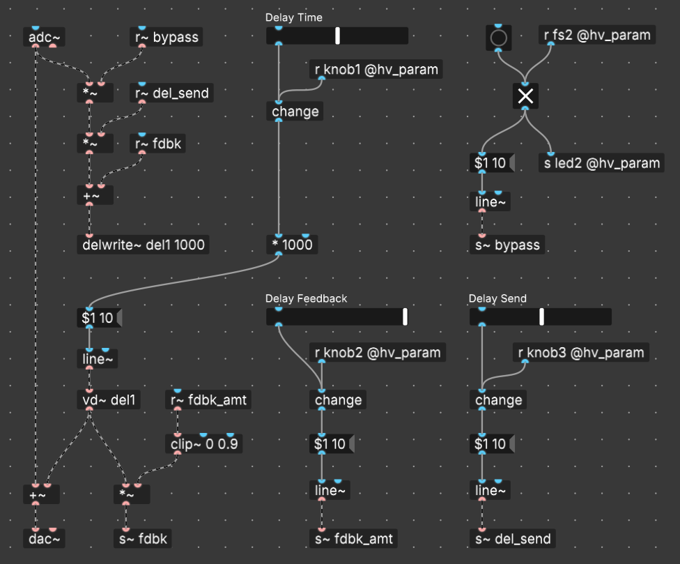

# Pure Data (Pd) Examples

Here you'll find a few very simple Pd patches that demonstrate the use of the Hothouse along with a custom board definition (`hothouse.json`) to be used when compiling. [Plugdata](https://github.com/plugdata-team/plugdata) (standalone) is *highly recommended* for its ease-of-use and direct flashing feature.

## Control mappings

Rather than create a separate README for each example, the control mappings and a patch diagram for each example are presented here.

### `hothouse-delay.pd`

A simple delay with the three parameters everyone expects. The toggle (for the bypass) and horizontal sliders are for testing at design time.

> [!NOTE]
> This example demonstrates how you might handle the switching when the effect is *additive* (like reverb or delay). This makes it **DRY *OR* (DRY + WET)** switching. In this setup, when the effect is engaged, the wet signal is *added* to the dry signal. (Note the `[+~]` object just before the `[dac~]`.) The dry signal is never muted, and the effect code itself can be thought of like it's on an FX send buss.

| CONTROL | DESCRIPTION | NOTES |
|-|-|-|
| KNOB 1 | TIME | The time between the dry and wet signal, and any repeats after that |
| KNOB 2 | FEEDBACK | Controls the level of wet signal fed back into the delay buffer; clipped at `0.9` |
| KNOB 3 | SEND | Sets the level of the dry signal sent to the delay buffer; think of it like an FX send on a mixer |
| KNOB 4 | Unused |  |
| KNOB 5 | Unused |  |
| KNOB 6 | Unused |  |
| SWITCH 1 | Unused |  |
| SWITCH 2 | Unused |  |
| SWITCH 3 | Unused |  |
| FOOTSWITCH 1 | Unused |  |
| FOOTSWITCH 2 | Bypass | The bypassed signal is buffered |

### `hothouse-tremolo.pd`

A super simple tremolo with the RATE and DEPTH controls.

> [!NOTE]
> This example shows an approach to switching between the dry signal and the wet signal. In this setup, when the effect is engaged, the dry signal is routed exclusively to the effect code. So, this is **DRY *OR* WET** switching.

| CONTROL | DESCRIPTION | NOTES |
|-|-|-|
| KNOB 1 | RATE | The rate of the LFO; 0.1Hz to 20Hz |
| KNOB 2 | DEPTH | The amplitude of the LFO sine wave |
| KNOB 3 | Unused |  |
| KNOB 4 | Unused |  |
| KNOB 5 | Unused |  |
| KNOB 6 | Unused |  |
| SWITCH 1 | Unused |  |
| SWITCH 2 | Unused |  |
| SWITCH 3 | Unused |  |
| FOOTSWITCH 1 | Unused |  |
| FOOTSWITCH 2 | Bypass | The bypassed signal is buffered |

### More to come
